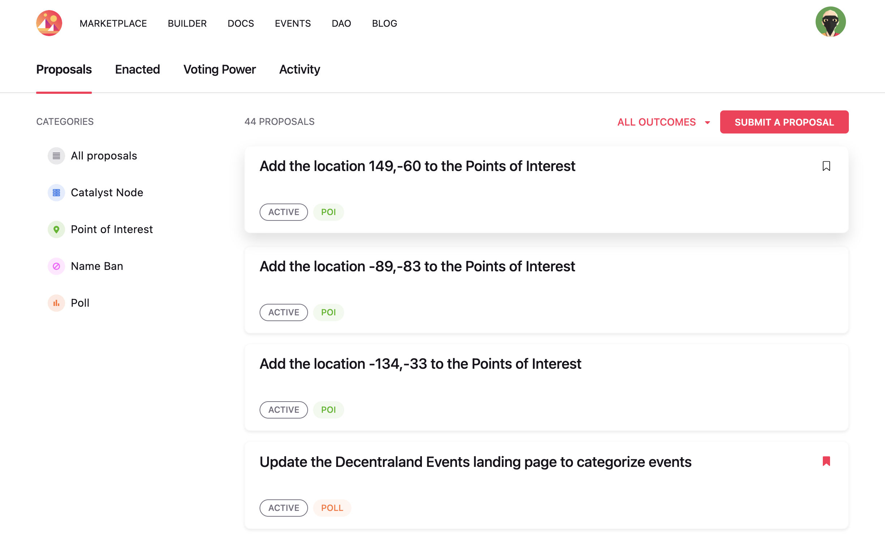

<p align="center">
  <a href="https://governance.decentraland.org">
    
  </a>
</p>
<h1 align="center">
  # Decentralized Autonomous Organization
</h1>

The governance hub for Decentraland. Create and vote on proposals that help shape the future of the metaverse.



## Setup

### environment setup

create a copy of `.env.example` and name it as `.env.development`

```bash
  cp .env.example .env.development
```

> to know more about this file see [the documentation](https://www.gatsbyjs.com/docs/how-to/local-development/environment-variables/#defining-environment-variables)

if you are running this project locally you only need to check the following environment variables:

* `CONNECTION_STRING`: make sure it is point to a valid database
* `COMMITTEE_ADDRESSES`: list of eth addresses separated by `,` that will be able to enact finished proposals
* `GATSBY_SNAPSHOT_SPACE`: a snapshot space where the proposal will be published
* `SNAPSHOT_PRIVATE_KEY`, `GATSBY_SNAPSHOT_ADDRESS`: a pair address/key with permissions to publish at that snapshot space
* `DISCOURSE_API_KEY`: the api key use to publish the proposals on the forum
* `ALCHEMY_API_KEY`: an alchemy api key to check the voting power

### setup the required voting power to pass

The minimum amount of voting power require to pass a proposal of each type it's defined in these variables, if they are not defined or are not numbers `0` will be used instead

```bash
  GATSBY_VOTING_POWER_TO_PASS_GRANT=0
  GATSBY_VOTING_POWER_TO_PASS_CATALYST=0
  GATSBY_VOTING_POWER_TO_PASS_BAN_NAME=0
  GATSBY_VOTING_POWER_TO_PASS_POI=0
  GATSBY_VOTING_POWER_TO_PASS_POLL=0
```

### database setup

once you have a `CONNECTION_STRING` you can setup you database tables using the following command

```bash
npm run migrate up
```

## Run

once you setup this project you can start it using the following command

```bash
  npm start
```

> Note 1: this project run over `https`, if it is your first time you might need to run it with `sudo`

> Note 2: you can disabled `https` removing the `--https` flag in the `develop` script of your `package.json`

## Project's structure

You can find a full documentation about the project's structure in the [`decentraland-gatsby` repository](https://github.com/decentraland/decentraland-gatsby#project-structure)

### back and front ends

this project runs gatsby as front-end and a nodejs server as back-end both connected through a proxy

* locally this proxy is defined in [`gatsby-config.js` (`proxy` prop)](https://www.gatsbyjs.com/docs/api-proxy/#gatsby-skip-here)
* at servers this proxy is defined in `Pulumi.ts` (`servicePaths` prop)

### routes

**front-end** routes are defined using [gatsby routes](https://www.gatsbyjs.com/docs/reference/routing/creating-routes/#define-routes-in-srcpages) + [gatsby-plugin-intl](https://www.gatsbyjs.com/plugins/gatsby-plugin-intl/?=gatsby-plugin-intl), you can find each page in the `src/pages` directory

**back-end** routes are defined using `express` you can find each route in `src/entities/{Entity}/routes.ts` and those are imported ar `src/server.ts`


## Copyright & License

This repository is protected with a standard Apache 2 license. See the terms and conditions in the [LICENSE](LICENSE) file.